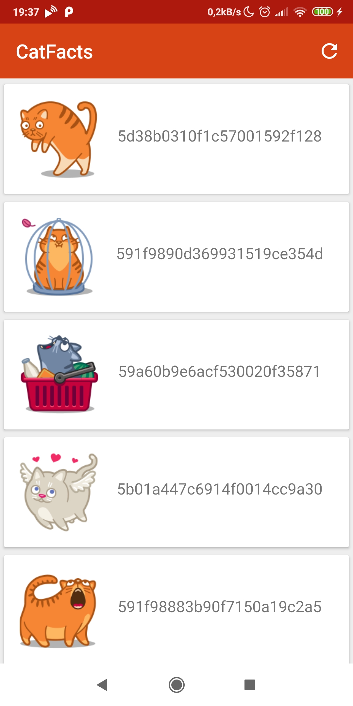
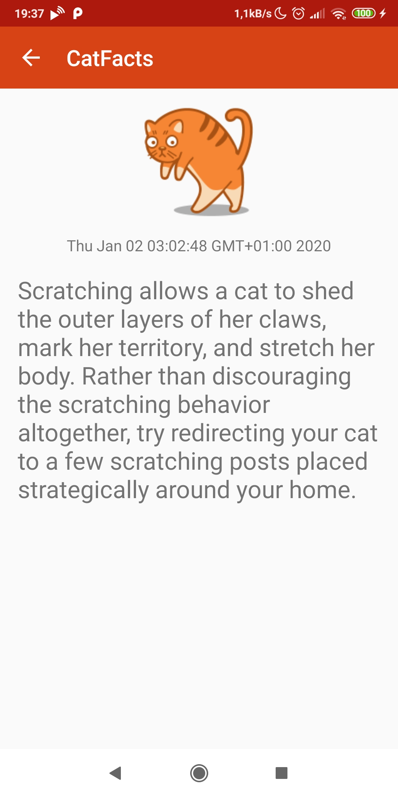
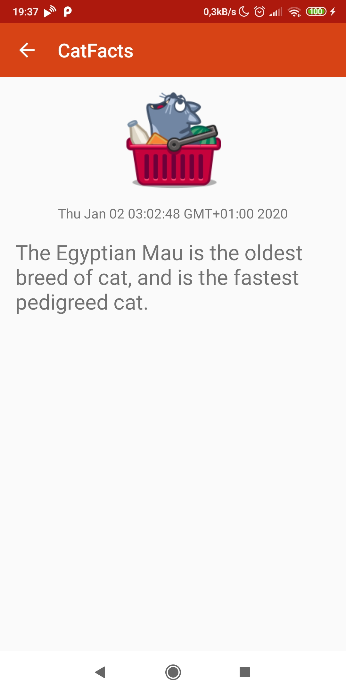

### CatFacts App
##### Android app fetching and displaying fun facts about cats. Nothing more.

##### Technology stack
- Kotlin
- MVI
- Retrofit
- Dagger
- Coroutines
- Mockk
- Espresso

#### Screenshots
###### Facts List Fragment

###### Fact Details Fragment

&nbsp;

#### Credits
- Used external api: [https://cat-fact.herokuapp.com/](https://cat-fact.herokuapp.com/)
- Cat icons comes from: [https://iconka.com/en/downloads/cat-power/](https://iconka.com/en/downloads/cat-power/)